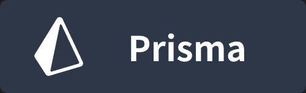
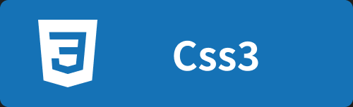
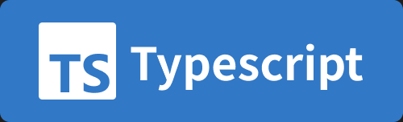
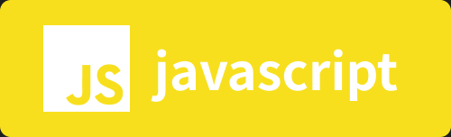
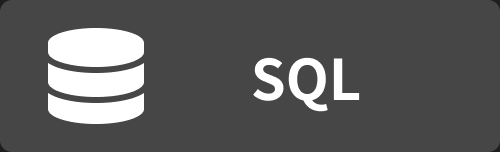

# Profile

### korea digital media high school WP 23

한국 디지털 미디어 고등학교 23기 웹 프로그래밍학과

-   풀스택 개발을 해요
-   다른 분야도 많이 도전해요
-   새로운 기술을 배우는 것을 좋아해요
-   코딩으로 스트레스를 풀어요

## 📚 Stack

### Frequently used stack

### Language

**- learning -** 

### ETC

